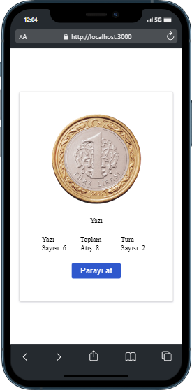
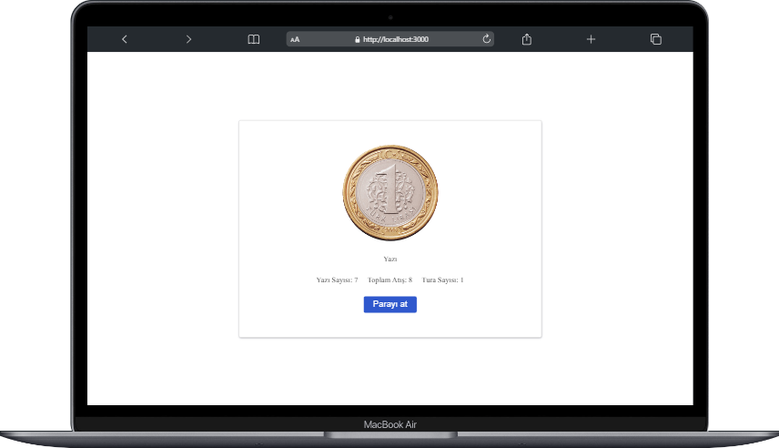

# React yazı tura :

### Proje özeti :

> Proje React ile yazıldı temel amaç yazı tura

### Proje durumu ve yapılacaklar :

- [x] yazı tura
- [x] yazı tura ve toplam atışı tutma
- [ ] yazı tura animasyon ekleme
- [x] responsive tasarım

### Projede kullanılan Teknolojiler ve Metotlar :

> Projede useState, hook kullanıldı.
> stilendirme için herhangi bir kütüphane kullanılmadı pure css ile stilendirme yapıldı.
> deploy için vercel kullanıldı.

### Proje Adresi

[volkiyazitura](https://volkiyazitura.vercel.app/)

### Projenin Görselleri:

